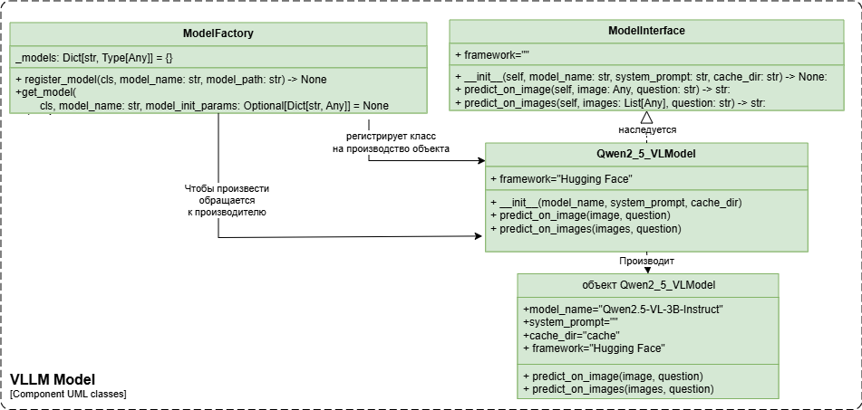

# 🤖 Model Interface — Универсальный интерфейс для VLM-моделей

[](https://www.python.org/downloads/)
[](https://python-poetry.org/)

**Model Interface** — это гибкий python-пакет для унификации работы с VLM-моделями для `VLMHyperBench`([ссылка](https://github.com/VLMHyperBenchTeam/VLMHyperBench)).

Может использоваться и в других проектах.

**Создана для:**
- Быстрой интеграция VLM-моделей (`база`: изображение, `prompt`: текст, `output`: текст)
- Единый интерфейс VLM для работы с разными фреймворками (`Hugging Face`, `vLLM`, `SGLang`)
- Осуществляет кэширование весов моделей

**В разработке:**
- Измерение времени инференса VLM и потребляемых ресурсов

## 🚀 Особенности

✨ **Основные возможности**:
- **Фабрика моделей** — динамическая регистрация VLM моделей на производство в `ModelFactory` из ваших python-пакетов всего за 2 строки кода
- **Универсальный интерфейс** — единые методы для работы со всеми VLM-моделями (унаследованными от `ModelInterface`)
- **Кэширование весов модели** — сохраняет веса модели локально в указанную вами папку `cache_dir` для повторного использования.
- **Совместимость** — работает с любыми фреймворками инференса через абстрактные классы `ModelFactory` и `ModelInterface`.

## 🏛️ Архитектура

- **ModelFactory**: Фабричный класс для регистрации и создания экземпляров моделей из python-пакетов.
- **ModelInterface**: Интерфейсный класс, который определяет стандартные методы для работы с VLM.



## 📚 Документация

TODO: скоро здесь появится ссылка.

## 📦 Установка

```bash
# Через Poetry
poetry add model-interface

# Или через pip
pip install model-interface
```

## 🛠 Использование

### 1. Регистрация модели

```python
from model_interface.model_factory import ModelFactory

# Регистрация новой модели
ModelFactory.register_model(
    model_name="my_custom_model",
    model_path="my_ml_models.module:MyModelClass"
)
```

### 2. Создание экземпляра
```python
model = ModelFactory.get_model(
    model_name="my_custom_model",
    model_init_params={
        "system_prompt": "Ты — эксперт по документам",
        "cache_dir": "/tmp/model_cache"
    }
)
```

### 3. Получение предсказаний
```python
# Для одного изображения
result = model.predict_on_image(image_object, "Что изображено на фото?")

# Для нескольких изображений
results = model.predict_on_images([img1, img2], "Сравни эти документы")
```

## 📂 Структура проекта
```
model_interface/
├── model_factory.py  — Фабрика для регистрации моделей
├── model_interface.py — Базовый абстрактный класс для всех моделей
└── model_utils.py    — Утилиты для измерения производительности
tests/                — Unit-тесты (пока пустые)
pyproject.toml        — Конфигурация проекта для Poetry
```

## 📦 Примеры реализации Python-пакетов для VLM

Этот пакет используется в следующих проектах:

### Простой пример реализации интерфейса с "шуточной" моделью

   Рекомендуется для первого ознакомления.

1. **[model_qwen2_vl_example](https://github.com/VLMHyperBenchTeam/model_qwen2_vl_example)**  
   
   Демонстрирует:
   - Регистрацию модели через `ModelFactory`
   - Реализацию абстрактного класса `ModelInterface`
   - Тестовый сценарий в `example.py`

### Примеры уже реализованных python-пакетов для VLM

1. **[model_qwen2-vl](https://github.com/VLMHyperBenchTeam/model_qwen2-vl)**

   Реальная реализация для семейства моделей Qwen2-VL:
   - Поддержка 2B/7B версий
   - Фреймворк Hugging Face
   - Обработка изображений с регулируемым разрешением
   - Примеры работы с документами (счета, накладные)

2. **[model_qwen2_5_vl](https://github.com/VLMHyperBenchTeam/model_qwen2.5-vl)**  
   Реальная реализация для семейства моделей Qwen2.5-VL:
   - Поддержка 2B/7B версий
   - Фреймворк Hugging Face
   - Обработка изображений с регулируемым разрешением
   - Примеры работы с документами (счета, накладные)
